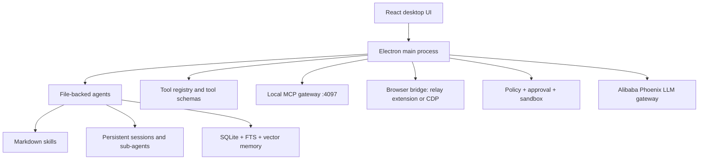

# Accio Work P0 Summary

Version stamp: `Accio v0.7.1 / capture date 2026-04-23`  
Scope: `P0-1` through `P0-5`, local device and own legal session only.

## Executive Read

Accio Work is best understood as a local desktop agent runtime, not a chat shell. The product center is:

`Electron desktop + React UI + file-backed agents + Markdown skills + local SQLite/vector memory + local MCP gateway + Alibaba model gateway + browser bridge + policy/approval/sandbox layer`.

For an open clone, the important lesson is not the Alibaba connector surface. The durable architecture is a desktop orchestrator that persists agents, sessions, tools, memory, browser workers, and permission decisions locally, while routing LLM calls through a gateway.

## P0 Findings

| Area | Judgment | Evidence |
|---|---|---|
| App shape | Native shell is `Electron 35.7.5`, bundle id `com.accio.desktop`, installed as `/Applications/Accio.app`; renderer is React with internal `@phoenix/*` packages. | [01-tech-stack.md](/Users/a1-6/research/acciowork/01-tech-stack.md), [p0-package.json](/Users/a1-6/research/acciowork/07-raw-evidence/p0-package.json) |
| Local runtime | It is a heavy local runtime: `node-pty`, `better-sqlite3`, `sqlite-vec`, `sharp`, `canvas`, and native `security_guard.node` are bundled. | [p0-native-modules.txt](/Users/a1-6/research/acciowork/07-raw-evidence/p0-native-modules.txt) |
| Agent model | An agent is a directory-backed runtime unit: `profile.jsonc`, `agent-core/*.md`, `tool-registry.jsonc`, `permissions`, `runtime`, `sessions`, `project`, and skills. | [02-agent-skill-model.md](/Users/a1-6/research/acciowork/02-agent-skill-model.md) |
| Skill model | Skills are mostly Markdown skill bundles; plugin-backed agents add templates, connector metadata, prompt rules, and bundled private skills. | [p02-skill-sample-1688-sourcing.md](/Users/a1-6/research/acciowork/07-raw-evidence/p02-skill-sample-1688-sourcing.md), [p02-plugin-agent-template.json](/Users/a1-6/research/acciowork/07-raw-evidence/p02-plugin-agent-template.json) |
| Memory/session | Local memory uses SQLite with FTS and `1536`-dimensional vector storage; sub-agents are persisted multi-session workers, not just one prompt pretending to be a team. | [p02-vector-memory-status.txt](/Users/a1-6/research/acciowork/07-raw-evidence/p02-vector-memory-status.txt), [p02-session-topology.redacted.md](/Users/a1-6/research/acciowork/07-raw-evidence/p02-session-topology.redacted.md) |
| Model gateway | Live model calls go to `https://phoenix-gw.alibaba.com/api/adk/llm`; model choice changes internal `1Nexus-* / 1Orbit-* / 1Drift-*` codes, while the client-side system prompt and tool list stay the same. | [p03-live-model-families.redacted.md](/Users/a1-6/research/acciowork/07-raw-evidence/p03-live-model-families.redacted.md) |
| Request signing | `sg_k` is produced client-side through bundled security-guard transport interception before the network request leaves the app. | [p03-sgk-security-guard.md](/Users/a1-6/research/acciowork/07-raw-evidence/p03-sgk-security-guard.md) |
| MCP | `accio-mcp.mjs` is a CLI client to the desktop app's local gateway on port `4097`, not a standalone MCP server; the gateway is loopback-gated in app logic. | [p03-mcp-cli-entry.md](/Users/a1-6/research/acciowork/07-raw-evidence/p03-mcp-cli-entry.md) |
| Browser automation | Browser control is dual-path by design: bundled Chrome relay extension plus observed direct CDP fallback on `9222`. Positive relay handshake is still unverified in this environment. | [p04-browser-dual-path.md](/Users/a1-6/research/acciowork/07-raw-evidence/p04-browser-dual-path.md), [p04-relay-retry-limited.md](/Users/a1-6/research/acciowork/07-raw-evidence/p04-relay-retry-limited.md) |
| Permissions | Permission is a three-layer system: `policy allow/ask/deny`, approval outcome, and OS sandbox scope. macOS execution uses real `/usr/bin/sandbox-exec` seatbelt policies. | [p05-permission-model.md](/Users/a1-6/research/acciowork/07-raw-evidence/p05-permission-model.md), [p05-sandbox-engine.md](/Users/a1-6/research/acciowork/07-raw-evidence/p05-sandbox-engine.md) |

## Architecture To Copy

## MVP Design Decisions

1. Use local filesystem directories as the primary agent/skill/session abstraction; this matches Accio's strongest design and keeps the clone inspectable.
2. Treat skills as Markdown-first packages with optional scripts and manifests; avoid starting with a heavy plugin VM.
3. Build sub-agents as persisted sessions with their own logs and state, not as hidden prompt sections inside one conversation.
4. Make tool registration explicit and serializable; Accio sends a full `tools[]` schema in live LLM requests.
5. Keep the model gateway pluggable; Accio's vendor routing is centralized, but the clone should make provider routing transparent and BYOK-friendly.
6. Design browser control as a transport abstraction with health states for `extension relay`, `direct CDP`, and `unavailable`.
7. Separate permission policy, approval workflow, and sandbox scope in the UI and data model; Accio's current UI compresses these layers.
8. Keep audit logs first-class: every tool call should record agent, conversation, cwd, write scope, decision, and command/file target.

## Remaining Unknowns

- Positive Chrome relay handshake still needs product-side state or a cleaner pairing path to reproduce.
- Public developer submission/review flow for skills is not fully mapped.
- P1 end-to-end business flows remain partial because external side effects were intentionally stopped before final submission.

## Bottom Line

Accio Work's defensible advantage is orchestration density: many local subsystems are already wired together. Its weak point is clarity. The open clone should copy the runtime shape, but make permissions, browser state, provider routing, tool schemas, and local data ownership explicit from day one.
