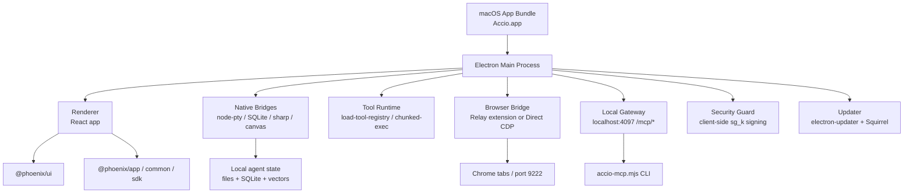

# Accio Work Tech Stack and Bundle Fingerprint

## Stage Status

- Scope covered in this stage: `P0-1 应用形态与技术栈指纹`
- Status: `initial pass complete`
- Target bundle on disk: `/Applications/Accio.app`
- Important naming note: marketing/product copy uses `Accio Work`, but the macOS bundle name is `Accio.app`

## Executive Judgment

`Accio Work` is an `Electron` desktop application with a `React` renderer, a substantial internal package set under the `@phoenix/*` namespace, and native desktop capability bridges for terminal execution, SQLite/vector search, image processing, and browser/CDP attachment.

The evidence is strong enough to treat it as:

1. `Electron 35.7.5`
2. `React` renderer
3. Internal UI/platform layer built around `@phoenix/ui`, `@phoenix/app`, `@phoenix/agent-runtime`
4. Tailwind-like utility CSS in the renderer
5. Native capability bridges via `node-pty`, `better-sqlite3`, `sqlite-vec`, `sharp`, `@napi-rs/canvas`
6. Electron-native update channel with `electron-updater` + `Squirrel.framework`
7. Local edge services for `MCP gateway`, `security-guard signing`, and `browser relay / direct CDP`

## Evidence Table

| Question | Finding | Evidence |
|---|---|---|
| App form factor | Electron app | [p0-info-plist.txt](/Users/a1-6/research/acciowork/07-raw-evidence/p0-info-plist.txt), [p0-frameworks.txt](/Users/a1-6/research/acciowork/07-raw-evidence/p0-frameworks.txt) |
| Electron fingerprint | `NSPrincipalClass = AtomApplication`, `Electron Framework.framework`, helper apps | [p0-info-plist.txt](/Users/a1-6/research/acciowork/07-raw-evidence/p0-info-plist.txt), [p0-finder-contents-cropped.png](/Users/a1-6/research/acciowork/06-screenshots/p0-finder-contents-cropped.png) |
| Electron version | `35.7.5` | [p0-electron-framework-info.txt](/Users/a1-6/research/acciowork/07-raw-evidence/p0-electron-framework-info.txt) |
| Bundle identity | `com.accio.desktop`, app version `0.7.1` | [p0-info-plist.txt](/Users/a1-6/research/acciowork/07-raw-evidence/p0-info-plist.txt), [p0-mdls.txt](/Users/a1-6/research/acciowork/07-raw-evidence/p0-mdls.txt) |
| Asar packaging | Main payload in `Resources/app.asar`; unpacked native modules in `app.asar.unpacked` | [p0-resources.txt](/Users/a1-6/research/acciowork/07-raw-evidence/p0-resources.txt), [p0-finder-resources-cropped.png](/Users/a1-6/research/acciowork/06-screenshots/p0-finder-resources-cropped.png) |
| Renderer framework | `react`, `react-dom`, compiled JSX, hook usage | [p0-package.json](/Users/a1-6/research/acciowork/07-raw-evidence/p0-package.json), [p0-renderer-react-signals.txt](/Users/a1-6/research/acciowork/07-raw-evidence/p0-renderer-react-signals.txt) |
| Internal platform layer | `@phoenix/agent-runtime`, `@phoenix/app`, `@phoenix/common`, `@phoenix/llm`, `@phoenix/sdk`, `@phoenix/ui` | [p0-package.json](/Users/a1-6/research/acciowork/07-raw-evidence/p0-package.json) |
| UI/component hints | Tailwind-style utility classes in `index.html`; `radix-ui` package present; internal `@phoenix/ui` likely wraps components | [p0-renderer-index.html](/Users/a1-6/research/acciowork/07-raw-evidence/p0-renderer-index.html), [p0-ui-state-fingerprints.txt](/Users/a1-6/research/acciowork/07-raw-evidence/p0-ui-state-fingerprints.txt) |
| Native capability bridge | `node-pty`, `better-sqlite3`, `sqlite-vec`, `sharp`, `@napi-rs/canvas` | [p0-native-modules.txt](/Users/a1-6/research/acciowork/07-raw-evidence/p0-native-modules.txt) |
| Auto-update | Generic update URL + beta channel + Squirrel | [p0-package.json](/Users/a1-6/research/acciowork/07-raw-evidence/p0-package.json), [app-update.yml](/Applications/Accio.app/Contents/Resources/app-update.yml:1) |
| Browser automation hints | Bundled Chrome extension + `cdp-*` chunks + `chrome-extension/accio-browser-relay` | [p0-asar-key-paths.txt](/Users/a1-6/research/acciowork/07-raw-evidence/p0-asar-key-paths.txt), [manifest.json](/Applications/Accio.app/Contents/Resources/chrome-extension/accio-browser-relay/manifest.json:1) |
| MCP/local tooling hints | `Resources/accio-mcp-cli/accio-mcp.mjs` exists in bundle | [p0-resources.txt](/Users/a1-6/research/acciowork/07-raw-evidence/p0-resources.txt) |
| Local MCP edge | Desktop app exposes localhost `4097` gateway; CLI talks to `/mcp/proxy`, `/mcp/oauth`, `/mcp/custom` | [p03-mcp-cli-entry.md](/Users/a1-6/research/acciowork/07-raw-evidence/p03-mcp-cli-entry.md) |
| Browser dual path | Relay extension defaults to ports `9234/9236`; runtime fallback to raw CDP `9222` observed | [p03-browser-relay-handshake.md](/Users/a1-6/research/acciowork/07-raw-evidence/p03-browser-relay-handshake.md), [p04-browser-dual-path.md](/Users/a1-6/research/acciowork/07-raw-evidence/p04-browser-dual-path.md) |
| Gateway request signing | Native `security_guard.node` plus transport interceptor adds `sg_k` before network send | [p03-sgk-security-guard.md](/Users/a1-6/research/acciowork/07-raw-evidence/p03-sgk-security-guard.md) |

## Bundle Structure

Top-level bundle structure under `/Applications/Accio.app/Contents`:

- `_CodeSignature`
- `Frameworks`
- `Info.plist`
- `MacOS/Accio`
- `Resources`

Evidence:

- [p0-bundle-structure.txt](/Users/a1-6/research/acciowork/07-raw-evidence/p0-bundle-structure.txt)
- [p0-finder-contents-cropped.png](/Users/a1-6/research/acciowork/06-screenshots/p0-finder-contents-cropped.png)

The `Frameworks` folder includes:

- `Electron Framework.framework`
- `Accio Helper.app`
- `Accio Helper (Renderer).app`
- `Accio Helper (GPU).app`
- `Accio Helper (Plugin).app`
- `Squirrel.framework`
- `Mantle.framework`
- `ReactiveObjC.framework`

This is standard Electron packaging, plus Electron-native update support.

## Core Packaging Fingerprints

### Electron

Evidence that this is Electron is direct, not inferred:

- `NSPrincipalClass = AtomApplication`
- `ElectronAsarIntegrity` entry for `Resources/app.asar`
- `Electron Framework.framework`
- Electron helper apps under `Frameworks`

### Versioning

- App version: `0.7.1`
- Electron Framework version: `35.7.5`
- Update channel: `beta`
- Update host: `https://work-download.accio-ai.com/package/`

## package.json Extraction

Extracted from `Resources/app.asar`:

- Package name: `@phoenix/desktop`
- Version: `0.7.1`
- Main entry: `./out/main/index.js`
- Package manager: `bun@1.3.5`

Notable dependencies:

- `react`
- `react-dom`
- `electron-updater`
- `node-pty`
- `sharp`
- `protobufjs`
- `prismjs`
- `@phoenix/agent-runtime`
- `@phoenix/app`
- `@phoenix/common`
- `@phoenix/llm`
- `@phoenix/sdk`
- `@phoenix/ui`
- `@phoenix-common/security-guard`

## Renderer Layer

### Confirmed

- Renderer entry HTML is [p0-renderer-index.html](/Users/a1-6/research/acciowork/07-raw-evidence/p0-renderer-index.html)
- It mounts onto `
`
- Compiled renderer chunks show `useState`, `useEffect`, and JSX calls

### Strong Inference

- CSS style tokens like `flex`, `flex-col`, `h-dvh`, `antialiased`, `overscroll-none`, `bg-zinc-50`, `dark:bg-zinc-800/50` strongly suggest a Tailwind-style utility CSS stack
- `radix-ui` exists in bundled node_modules, but top-level component ownership likely sits in internal package `@phoenix/ui`

### Not Yet Confirmed

- No clear direct top-level evidence yet for a public state library like `redux`, `zustand`, `mobx`, `jotai`, or `xstate`
- Current working assumption: state management is either internal to `@phoenix/*` packages or tree-shaken from direct package names

## Native/Desktop Capability Layer

`app.asar.unpacked/node_modules` contains:

- `node-pty`
- `better-sqlite3`
- `sqlite-vec`
- `sharp`
- `@napi-rs/canvas-darwin-arm64`
- `@phoenix-common/security-guard`

That combination strongly supports:

- local terminal/process execution
- local SQLite-backed persistence
- vector search / embeddings retrieval
- image processing / screenshot normalization
- local security/permission guard rails

## Main-Process Capability Hints

Relevant chunk names in `app.asar`:

- `load-tool-registry`
- `chunked-exec`
- `capture`
- `screenshot`
- `cdp-tab-tracker`
- `cdp-url-resolver`
- `pairings-manager`
- `subagent-session-store`

These point to an architecture that includes:

- runtime tool registration
- command/process execution
- screenshot/image normalization
- CDP-based browser attachment
- agent pairing/approval flows
- child session persistence

## Local Runtime Edges

Three local edge services now have direct evidence:

1. `MCP Gateway`
   - `Accio.app` listens on local port `4097`
   - `accio-mcp.mjs` is a thin CLI over `http://127.0.0.1:4097/mcp/*`
   - non-loopback requests are rejected with `403 Forbidden`
2. `Security Guard`
   - the bundle carries `@phoenix-common/security-guard` plus native `security_guard.node`
   - request signing is injected before LLM traffic leaves the desktop app
3. `Browser Bridge`
   - preferred path is a Chrome relay extension with control port `9234` and relay port `9236`
   - observed runtime fallback is direct Chrome discovery on port `9222`

## First-Pass Architecture Sketch

## Open Questions for Next Stage

1. `@phoenix/ui` is present, but how much of the component system is internal versus wrapped third-party libraries is still open.
2. The state management layer is not yet directly fingerprinted.
3. We have strong browser/CDP hints, but the exact flow needs P0-4 validation.
4. We have not yet mapped renderer route modules to product features in a systematic way.
