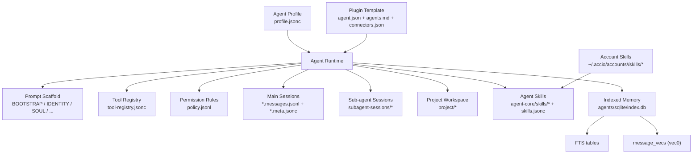

# Accio Work Agent and Skill Model

## Stage Status

- App version under analysis: `Accio v0.7.1`
- Capture date: `2026-04-22`
- Scope in this document: `P0-2 Agent / Skill 系统数据模型`
- Status: `main pass complete`
- Related P0-3 evidence is partially linked here where it intersects the runtime

## Executive Judgment

`Accio Work` uses a file-backed local agent runtime, not a prompt-only chat shell.

The core abstraction is:

1. One `agent` = one local directory with `profile + prompt scaffold + tool registry + permission policy + runtime state + session logs + optional project workspace`
2. One `skill` = primarily a `Markdown package` with YAML frontmatter, optional `references/`, `examples/`, `scripts/`, and an index file
3. One `plugin agent` = `agent.json + agents.md + connectors.json + resources/* + bundled skills`
4. Team/sub-agent execution is `true multi-session persistence`, but current evidence points to `same-process runtime + separate session stores`, not OS-level worker processes
5. Memory is split into:
   - file memory: `MEMORY.md`, daily diary, heartbeat scaffolds
   - indexed memory: account-level SQLite + FTS + `sqlite-vec` schema

## Evidence Table

| Question | Finding | Evidence |
|---|---|---|
| What is a local agent? | File-backed object with profile, agent-core, permissions, runtime, sessions, project | [p02-agent-profile-sample.redacted.jsonc](/Users/a1-6/research/acciowork/07-raw-evidence/p02-agent-profile-sample.redacted.jsonc), [p02-agent-core-sample.md](/Users/a1-6/research/acciowork/07-raw-evidence/p02-agent-core-sample.md), [p02-runtime-snippets.md](/Users/a1-6/research/acciowork/07-raw-evidence/p02-runtime-snippets.md) |
| How is the prompt composed? | Layered from `BOOTSTRAP.md`, `IDENTITY.md`, `SOUL.md`, `AGENTS.md`, `TOOLS.md`, `USER.md`, `MEMORY.md`, `HEARTBEAT.md` | [p02-agent-core-sample.md](/Users/a1-6/research/acciowork/07-raw-evidence/p02-agent-core-sample.md), [agent-core](/Users/a1-6/.accio/accounts/1758713785/agents/DID-F456DA-88F456DAU1776920-5478-FF989B/agent-core) |
| How are tools modeled? | Registration and permission are orthogonal: `tool-registry.jsonc` decides registration, `policy.jsonl` decides allow/ask/deny | [tool-registry.jsonc](/Users/a1-6/.accio/accounts/1758713785/agents/DID-F456DA-88F456DAU1776920-5478-FF989B/agent-core/tool-registry.jsonc:1), [policy.jsonl](/Users/a1-6/.accio/accounts/1758713785/agents/DID-F456DA-88F456DAU1776920-5478-FF989B/permissions/policy.jsonl:1) |
| What is a skill? | Markdown package with frontmatter + docs + references/examples/scripts | [p02-skill-sample-1688-sourcing.md](/Users/a1-6/research/acciowork/07-raw-evidence/p02-skill-sample-1688-sourcing.md), [skills_config.json](/Users/a1-6/.accio/accounts/1758713785/skills/skills_config.json:1) |
| Where do agent-level skills live? | Under `agents/<id>/agent-core/skills`, indexed by `skills.jsonc` | [skills.jsonc](/Users/a1-6/.accio/accounts/1758713785/agents/DID-F456DA-88F456DAU1776920-5478-FF989B/agent-core/skills/skills.jsonc:1) |
| Are sub-agents real sessions? | Yes. Main session and sub-agent session each have separate `meta.jsonc` and `messages.jsonl`, plus a `subagent-sessions/sessions.json` registry | [p02-session-topology.redacted.md](/Users/a1-6/research/acciowork/07-raw-evidence/p02-session-topology.redacted.md), [sessions.json](/Users/a1-6/.accio/accounts/1758713785/subagent-sessions/sessions.json:1) |
| Is vector memory present? | Yes at schema/runtime level: SQLite `message_vecs` virtual table, FTS tables, runtime `SessionIndexStore` | [p02-vector-schema.txt](/Users/a1-6/research/acciowork/07-raw-evidence/p02-vector-schema.txt), [p02-vector-memory-status.txt](/Users/a1-6/research/acciowork/07-raw-evidence/p02-vector-memory-status.txt), [p02-runtime-snippets.md](/Users/a1-6/research/acciowork/07-raw-evidence/p02-runtime-snippets.md) |
| How do plugin agents differ? | They add `agent.json`, `agents.md`, connector config, policy rules, onboarding, and bundled skills | [p02-plugin-agent-template.json](/Users/a1-6/research/acciowork/07-raw-evidence/p02-plugin-agent-template.json), [agents.md](/Users/a1-6/.accio/accounts/1758713785/plugins/installed/alibaba-com-seller-assistant/agents/alibaba-com-seller-assistant/agents.md:1) |

## Core Agent Data Model

| Layer | Location | Purpose | Key fields / behavior |
|---|---|---|---|
| Agent profile | `agents/<id>/profile.jsonc` | Mutable top-level config | `id`, `name`, `description`, `toolPreset`, `templateId`, `runtime`, `agentType`, `model`, `defaultProject`, `localMemoryIndex` |
| Prompt scaffold | `agents/<id>/agent-core/*.md` | Split system prompt / persona / startup rules / long-term files | `BOOTSTRAP`, `IDENTITY`, `SOUL`, `AGENTS`, `TOOLS`, `USER`, `MEMORY`, `HEARTBEAT` |
| Tool registry | `agents/<id>/agent-core/tool-registry.jsonc` | Tool registration layer | `preset`, builtin include/exclude, MCP registrations, conditional tools |
| Permission policy | `agents/<id>/permissions/policy.jsonl` | Tool approval layer | per-prefix rules like `write allow`, `browser ask`, `bash ask` |
| Audit log | `agents/<id>/permissions/audit.jsonl` | Tool-call audit trail | action, cwd, files, rule decision |
| Runtime state | `agents/<id>/runtime/state.jsonc` | Lifecycle/status | `agentId`, `lifecycle`, `updatedAt` |
| Project dir | `agents/<id>/project/` | Writable task workspace | scripts, extracted JSON, generated artifacts |
| Session logs | `agents/<id>/sessions/*.messages.jsonl` + `*.meta.jsonc` | Main-session persistence | user/assistant/tool messages, usage, tool calls |
| Agent skill index | `agents/<id>/agent-core/skills/skills.jsonc` | Installed agent-level skills | `id`, `name`, `version`, `enabled`, `entryName`, `installPath` |

The local `Accio` agent sample shows these profile fields directly in [p02-agent-profile-sample.redacted.jsonc](/Users/a1-6/research/acciowork/07-raw-evidence/p02-agent-profile-sample.redacted.jsonc).

### Prompt Composition

The prompt is not stored as one monolithic `systemPrompt` string on disk. Instead, it is assembled from files:

- `BOOTSTRAP.md`: startup order, first-run behavior
- `IDENTITY.md`: name, role, communication rules
- `SOUL.md`: personality and self-evolving layer
- `AGENTS.md`: general task behavior / routing rules
- `TOOLS.md`: tool list placeholder, dynamically injected from registry
- `USER.md`: user-specific context slot
- `MEMORY.md`: long-term memory file
- `HEARTBEAT.md`: recurring/self-reminder layer

This decomposition matters for our clone: Accio’s “system prompt” is already a file graph.

## Tool Registration vs Permission Boundary

Accio explicitly separates:

1. Registration: can this tool appear in the agent’s tool list?
2. Permission: if registered, is it `allow`, `ask`, or `deny` at execution time?

`tool-registry.jsonc` says this in plain text:

- registration chain: `注册 → 能力层 → 权限层 → 执行`
- preset examples: `full`, `standard`, `developer`, `minimal`, `tl`, `none`

Observed policy differences across built-in agents:

| Agent | Auto-allow | Ask |
|---|---|---|
| `Accio` | `write`, `edit`, `apply_patch` | none observed |
| `Coder` | `write`, `edit`, `apply_patch` | none observed |
| `Shopify Operator` | `write`, `edit` | `apply_patch`, `bash`, `browser` |
| `Ecommerce Mind` | none observed beyond defaults | `browser` |
| `国际站生意助手` | `write`, `edit`, `apply_patch` | `browser` |

This is a strong design cue: permission profile is agent-specific, not only global.

## Skill Packaging Model

### Account-Level Skills

Observed account-level skill package:

- path: [1688-sourcing](/Users/a1-6/.accio/accounts/1758713785/skills/1688-sourcing)
- main file: [SKILL.md](/Users/a1-6/.accio/accounts/1758713785/skills/1688-sourcing/SKILL.md:1)
- supporting dirs:
  - `references/`
  - `examples/`

Format:

1. YAML frontmatter: `name`, `description`
2. Main markdown body: workflow, hard gates, tool usage rules, output format
3. Optional helper assets: scripts, field maps, examples

This is much closer to `instructional skill package` than to executable plugin code.

### Agent-Level Skills

Agent-level skills live under `agents/<id>/agent-core/skills`, not under `agents/<id>/skills`.

Observed counts:

| Agent | Skill count |
|---|---:|
| `Shopify Operator` | 21 |
| `Ecommerce Mind` | 14 |
| `国际站生意助手` | 32 |
| `Coder` | 8 |
| `Accio` | 9 |

`Accio` agent sample skill index: [skills.jsonc](/Users/a1-6/.accio/accounts/1758713785/agents/DID-F456DA-88F456DAU1776920-5478-FF989B/agent-core/skills/skills.jsonc:1)

It stores:

- `id`
- `name`
- `version`
- `enabled`
- `kind`
- `entryName`
- `description`
- `installPath`

So skills are first-class installable assets with their own metadata index.

### Plugin-Backed Agent Packages

The Alibaba merchant assistant plugin adds another layer:

- [agent.json](/Users/a1-6/.accio/accounts/1758713785/plugins/installed/alibaba-com-seller-assistant/agents/alibaba-com-seller-assistant/agent.json:1)
- [agents.md](/Users/a1-6/.accio/accounts/1758713785/plugins/installed/alibaba-com-seller-assistant/agents/alibaba-com-seller-assistant/agents.md:1)
- [connectors.json](/Users/a1-6/.accio/accounts/1758713785/plugins/installed/alibaba-com-seller-assistant/connectors/connectors.json:1)

`agent.json` adds fields not present in a basic user agent profile:

- `policyRules`
- `catalogSkillIds`
- `onboarding`
- `sourcePluginId`

This means a plugin is effectively a packaged agent template plus skill bundle plus connector bindings.

## Team Lead and Sub-Agent Runtime Model

### Conclusion

`Team Lead runtime-created child agents` are `real persisted sessions`, but current evidence suggests they are implemented inside the same desktop runtime, not as separate OS processes.

### Why this is the most defensible reading

Evidence for real session separation:

1. Main and sub-agent sessions are stored separately in JSONL/meta files
2. `subagent-sessions/sessions.json` tracks `parentSessionKey`, `agentId`, `label`, `status`
3. Main session logs contain `sessions_spawn`
4. Sub-agent session files contain their own system prompt, tool calls, and results
5. Runtime wiring creates both `FileSessionStore(...)` and `SubAgentSessionStore(...)`

Evidence against “separate OS worker per sub-agent”:

1. No direct evidence yet of per-subagent `child_process` spawn
2. The runtime bundle shows shared in-process stores and shared LLM/tool executors
3. The session abstraction looks closer to `multi-session orchestration` than `multi-process supervision`

### Concrete Example

From [p02-session-topology.redacted.md](/Users/a1-6/research/acciowork/07-raw-evidence/p02-session-topology.redacted.md):

- main session user asks to search Alibaba
- main session calls `sessions_spawn` with `agent_id="browser"`
- sub-agent gets a dedicated browser-subagent system prompt
- sub-agent runs `browser` and `write`
- sub-agent returns a structured result
- main session summarizes back to the user

That is enough to rule out “single LLM call pretending to be a team.”

## Memory and Vector Retrieval

### File Memory

Every agent has:

- [MEMORY.md](/Users/a1-6/.accio/accounts/1758713785/agents/DID-F456DA-88F456DAU1776920-5478-FF989B/agent-core/MEMORY.md)
- `HEARTBEAT.md`
- runtime support for diary files and periodic decay/merge

The runtime’s `buildMemoryFlushPrompt` writes to:

- daily diary: `.../diary/YYYY-MM-DD.md`
- long-term memory: `MEMORY.md`

and explicitly tells the agent to merge rather than overwrite.

### Indexed Memory

Indexed memory lives at:

- [index.db](/Users/a1-6/.accio/accounts/1758713785/agents/sqlite/index.db)

Schema evidence:

- `sessions`
- `messages`
- FTS tables: `messages_fts*`
- vector table: `message_vecs`

Schema excerpt: [p02-vector-schema.txt](/Users/a1-6/research/acciowork/07-raw-evidence/p02-vector-schema.txt)

Key finding:

- vector grain is `per message`, not per agent document
- embedding dimension is `1536`
- storage is `account-level shared DB`, not one DB per agent

The runtime snippet shows `SessionIndexStore` behavior:

1. append each message into SQLite
2. optionally generate embedding for the message text
3. run nearest-neighbor dedup
4. insert into `message_vecs`
5. support cross-session duplicate detection

Important nuance from the sampled machine state:

- runtime log says `Session vector index enabled (embeddingFn ready)`
- but sampled `message_vecs_rowids/chunks` are currently `0`

Most likely explanations:

1. vector indexing is enabled but no eligible writes had been flushed yet
2. current session sample is too small/new
3. another code path gates embedding writes

I do **not** yet have a decisive answer for which embedding model produces those 1536-d vectors. That remains open.

### Long-Term Memory Decay

The bundle exports:

- `LongTermMemoryDecayRunner`
- `createLongTermMemoryDecayScheduler`

and the runtime log shows:

- default runtime model: internal `1Nexus-*`
- auto-decay model: `1Drift-V4jL6mX3yE8d`

Given the current model cache, that maps to:

- `1Drift-V4jL6mX3yE8d` = `Qwen 3.6 Plus`

So long-term memory refinement is likely delegated to a cheaper dedicated model path.

## Data Model Sketch

## Design Implications for Our Open Clone

The most important takeaways are:

1. Keep `agent profile`, `prompt scaffold`, `tool registration`, and `permission policy` as separate artifacts.
2. Treat skills as content-addressable packages, not only code modules.
3. Implement sub-agents as separate persisted sessions first; OS process isolation can be layered on later.
4. Use one shared account-level retrieval DB for conversation memory, not one DB per agent.
5. Reserve a plugin format for “agent template + skill bundle + connector policy” rather than only tool extensions.

## Open Points

1. Exact embedding model/provider for `SessionIndexStore.embeddingFn` is still unresolved.
2. I have not yet seen proof of a separate worker process per sub-agent; current evidence favors same-process multi-session orchestration.
3. The current sampled DB had vector schema but zero vector rows, so recall write timing still needs confirmation.
