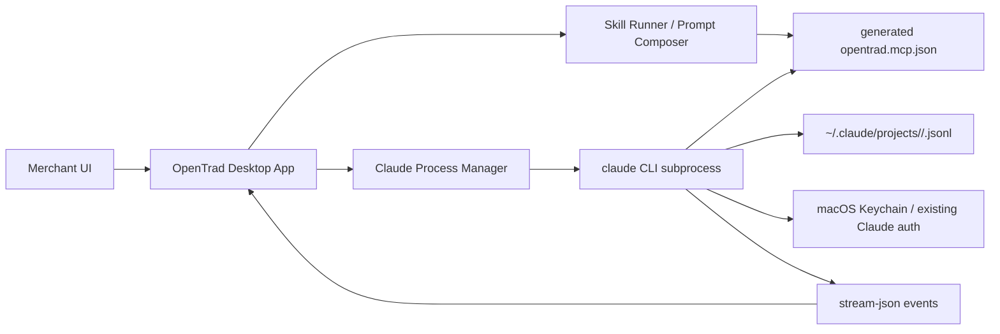

# OpenTrad: Claude Code 集成可行性

抓取日期：2026-04-23（America/Los_Angeles）  
本地样本：Claude Code `2.1.119`，macOS，已登录 Claude Pro；账号、组织、session id 均已脱敏。  
核心证据：`../07-raw-evidence/cc-local-cli-probe.redacted.md`、`../07-raw-evidence/cc-official-docs-evidence.md`

## 结论先行

OpenTrad v1 最稳的路线不是直接接 Anthropic API，也不是把 Claude Agent SDK 当主入口，而是**把用户本机的 Claude Code CLI 当受信任 agent runtime，用本地子进程/PTY 包装成 GUI**。

推荐调用形态：

```bash
claude -p \
  --output-format stream-json \
  --verbose \
  --mcp-config /path/to/opentrad.mcp.json \
  --session-id <uuid> \
  --permission-mode default \
  "<user prompt>"
```

原因：

- CLI 已支持非交互 `--print`、结构化 `json` / `stream-json`、`--json-schema`、`--mcp-config`、`--continue` / `--resume` / `--session-id`，能满足 GUI 渲染和会话续聊。
- CLI 能复用用户本机 `claude auth login` 的 Claude Pro/Max/Team 订阅 OAuth；我们不接触 token。
- 官方 Claude Agent SDK 是更干净的库接口，但官方文档明确要求第三方产品使用 API key / Bedrock / Vertex / Foundry，不能默认复用 claude.ai 登录和订阅额度，除非 Anthropic 另行批准。
- SDK 仍值得保留为 v2/BYOK/企业版路径；v1 面向“商家已有 Claude Code 订阅”的低门槛工作台，应优先封装 CLI。

## 1.1 程序化集成方式

| 路径 | 可行性 | 认证/计费 | 结构化输出 | 适合 OpenTrad v1 吗 | 证据 |
| --- | --- | --- | --- | --- | --- |
| CLI `--print` | 高 | 复用用户本机 Claude Code 登录；也支持 API key/env | `--output-format json` 单次结果；`stream-json` 实时事件；`--json-schema` 校验最终结构 | 是，主路径 | 官方 CLI 文档列出 `--print`、`--output-format`、`--mcp-config`、`--resume`；本地实测成功 |
| CLI 交互 PTY | 高 | 同 CLI | 原生输出有 ANSI，需要解析或只作为登录/权限 fallback | 是，作为登录、权限、debug fallback | 本地 `claude --help`；社区 GUI 多采用真实 PTY |
| Claude Agent SDK | 中 | 官方示例要求 `ANTHROPIC_API_KEY`；也支持 Bedrock/Vertex/Foundry；第三方不能默认复用 claude.ai 额度 | TypeScript `query()` 返回 `AsyncGenerator<SDKMessage>`，支持结构化输出、MCP、权限、sessions | 不建议作 v1 默认；适合 BYOK 模式 | 官方 SDK overview/type reference |
| `claude remote-control` | 低 | 必须 claude.ai 订阅 OAuth | 面向 claude.ai/code 的远控，不是本地 API | 不适合作 OpenTrad 内核 | 官方 Remote Control 文档和本地 help |
| `claude mcp serve` | 低 | 作为 MCP server 暴露 Claude Code 工具 | 不是“让我们调用 Claude agent”的模型服务 | 可做互操作，不是主路径 | 官方 MCP 文档 |

本地非交互实测：

- `claude -p --output-format json --tools "" --no-chrome --max-turns 1 "Return exactly OK."` 返回 `type=result`、`subtype=success`、`result=OK`、`usage`、`modelUsage`、`permission_denials`、`total_cost_usd`。
- `claude -p --output-format stream-json --verbose --tools "" --model haiku ...` 返回 NDJSON 事件：`rate_limit_event`、`system/init`、`assistant`、`result`。`system/init` 中包含 `tools`、`mcp_servers`、`model`、`permissionMode`、`apiKeySource`、`claude_code_version` 等字段。

## 1.2 MCP 支持

Claude Code MCP 的配置入口已足够支撑 OpenTrad 安装向导自动写入：

| 配置层级 | 文件/入口 | 用途 |
| --- | --- | --- |
| local | `~/.claude.json` 中按 project path 记录 | 当前项目私有 MCP，适合用户自己的 token/路径 |
| project | 项目根 `.mcp.json` | 团队共享 MCP，可进版本库；Claude Code 首次使用会提示信任 |
| user | `~/.claude.json` | 跨项目私有 MCP |
| CLI 临时 | `--mcp-config <json-file-or-json-string>` | 最适合 OpenTrad v1：运行时生成，不污染用户全局配置 |

支持 transport：

- `stdio`：本地进程型 server，配置 `command`、`args`、`env`。
- `http` / `sse`：远端或本地 HTTP MCP，配置 `url`、`headers`，支持 OAuth / headers helper。
- SDK 还支持 in-process MCP server，但这是 SDK 路径，不是 CLI 主路径。

启动时机判断：

- `stdio` server 在 Claude Code 建立 MCP connection 时由 Claude Code 拉起；官方 `claude mcp list/get` 提醒会 spawn `.mcp.json` 里的 stdio server 做 health check。
- HTTP/SSE 在 session start 或 reconnect 时建立连接；官方文档说明 `headersHelper` 每次 connection 都会 fresh 运行。
- 插件内置 MCP server 在插件启用后自动启动，但 MCP server 变更需要重启 Claude Code 才生效。

用户如何看到工具：

- 交互 UI 里用 `/mcp` 查看 MCP server 状态。
- 工具名进入 Claude Code 后通常表现为 `mcp__<server>__<tool>`；SDK/CLI 可通过 `allowedTools` 白名单，例如 `mcp__opentrad__*`。
- OpenTrad v1 应在安装向导生成 `opentrad.mcp.json`，并在每次启动 CLI 时传 `--mcp-config`；必要时用 `--strict-mcp-config` 让一次任务只看到 OpenTrad 指定工具。

## 1.3 内嵌到桌面应用的路径

### 路径 A：本地子进程/PTY 包装 CLI

判断：**可行，v1 推荐。**

实现建议：

- 普通任务用 `child_process.spawn` 跑 `claude -p --output-format stream-json --verbose`，按行解析 NDJSON。
- 登录、首次 workspace trust、权限确认、异常 debug 用 PTY（Electron 可用 `node-pty`，Tauri 可用 Rust `portable-pty` 或 sidecar）。
- UI 映射 `system/init`、`assistant`、`tool_use`、`tool_result`、`result`、`rate_limit_event` 为消息卡片、工具卡片、额度提示。
- 会话创建时生成 UUID，传 `--session-id`；继续会话用 `--resume <session-id>` 或 `--continue`。
- 对外贸高风险动作，OpenTrad 自己先做“最终确认前停止”策略；不要依赖 Claude Code 单独兜底。

主要难点：

- `stream-json` schema 不是稳定公共协议，版本升级可能变字段；需要 schema version guard。
- 权限 prompt 在非交互模式下要么预配置 permission mode/allowed tools，要么通过官方 `--permission-prompt-tool` 接 MCP 工具处理，要么 fallback 到 PTY。
- 订阅额度、rate limit 事件可见但不保证每次出现；UI 不能把它当强一致账单。

### 路径 B：headless / server 模式

判断：**CLI 没有适合本地嵌入的通用 HTTP/IPC server。**

可用但不适合作主路径的 server：

- `claude remote-control` 是 Anthropic 托管远控通道：本地进程只发 outbound HTTPS，不开本地端口，供 claude.ai/code 或移动端控制，不是 OpenTrad 可直接连的本地 API。
- `claude mcp serve` 是把 Claude Code 的文件/编辑等工具暴露给另一个 MCP client；它不是“Claude agent as a service”，并且调用方要自己做用户确认。
- Claude Agent SDK 是真正 headless library，但默认走 API key/云厂商凭证，不能假设复用用户订阅。

### 路径 C：参考实现

判断：**已有开源项目验证了“真实 CLI + GUI”的方向。**

- Zed 官方文档显示其外部 Claude Agent 通过 ACP adapter 运行 Claude Agent SDK / Claude Code，并可使用 Claude Code 登录；但 Zed 同时提示外部 agent 某些功能如历史恢复、checkpoint 不完全可用。
- `winfunc/opcode` 是 Tauri GUI/toolkit for Claude Code，强调独立进程、权限控制、本地存储、无遥测。
- 社区里 Electron/xterm.js、Tauri wrapper、PTY 多 session 工具不少，说明技术路线可行；但大多仍是开发者场景，外贸商家所需的是模板化 skill、风险确认和连接器。

## 1.4 登录、订阅和凭证

首次登录流程：

- 官方文档：安装后运行 `claude`，首次启动会打开浏览器登录；如果浏览器没有自动打开，可按 `c` 复制登录 URL。
- 本地 help：`claude auth login --claudeai` 默认走 Claude subscription；也支持 `--console`、`--email` 预填、`--sso`。
- 本地状态：`claude auth status --text` 可显示登录方式、组织、邮箱；报告中已脱敏。

凭证位置：

- macOS：官方说明存储在加密 macOS Keychain。
- Linux/Windows：`~/.claude/.credentials.json` 或 `$CLAUDE_CONFIG_DIR` 下。
- OpenTrad 不应读取或搬运凭证文件；只调用 `claude auth status` 做状态展示，并把 stdout 做邮箱/组织脱敏。

订阅和额度：

- CLI 可以用 Claude Pro/Max/Team/Enterprise OAuth，也可以用 Console API key 或云厂商。
- SDK 文档明确：第三方开发者不应提供 claude.ai login 或 rate limits 给自己的产品，除非获批；所以 OpenTrad 不能把 SDK + 订阅复用当默认假设。
- `stream-json` 实测出现 `rate_limit_event.rate_limit_info`，字段包括 `status`、`resetsAt`、`rateLimitType`、`overageStatus`、`overageDisabledReason`、`isUsingOverage`。这可以作为 UI 的“额度提示”，但不是完整账单 API。

## 1.5 安装方式和运行时体积

官方安装路径：

- 推荐：`curl -fsSL https://claude.ai/install.sh | bash`。
- macOS/Linux 也可 Homebrew；Windows 可 WinGet；Linux 可 apt/dnf/apk。
- GitHub README 标注 npm 安装已 deprecated；setup 文档仍说明 `npm install -g @anthropic-ai/claude-code` 可用，且 npm 包安装的是同一个 native binary。

对 OpenTrad 的含义：

- **无需为了跑 Claude Code 自带 Node runtime。** 官方 setup 文档说明 npm 包拉取 per-platform native optional dependency，安装后的 `claude` binary 本身不调用 Node。
- 本机样本中 `~/.claude/bin/claude` 是 4.3 KB shell shim，真正 runtime/cache 在 `~/.local/share/claude`；当前机器该目录约 792 MB，包含历史版本/缓存，不应直接等同发行体积。
- 如果 OpenTrad 选择 Electron，会天然带 Chromium/Node，体积主要来自 Electron 而不是 Claude Code。
- 如果 OpenTrad 选择 Tauri，应用体积更小，但 PTY、进程管理、签名更新链路要写 Rust/sidecar。
- 若强行自带 Node 只为 npm 安装 Claude Code，收益低；粗略会增加 70-110 MB 未压缩运行时，且仍要处理 native optional dependency、签名和更新。

## 架构建议

OpenTrad v1：



必须先做的工程护栏：

- 启动前检测 `claude --version`、`claude auth status`、workspace trust 状态。
- 每个 skill 生成明确的 `allowedTools`、`mcp-config` 和风险声明。
- 外部副作用动作默认分两段：先生成草稿/预览，用户确认后再执行。
- 持久化 OpenTrad 自己的 session metadata，但不复制 Claude 凭证；Claude transcript 可引用本机路径或用 SDK `list/getSessionMessages` 类能力做只读展示。

## Sources

- [Claude Code CLI reference](https://code.claude.com/docs/en/cli-usage)
- [Claude Agent SDK overview](https://code.claude.com/docs/en/agent-sdk/overview)
- [Claude Agent SDK TypeScript reference](https://platform.claude.com/docs/en/agent-sdk/typescript)
- [Claude Code MCP](https://code.claude.com/docs/en/mcp)
- [Claude Code authentication](https://code.claude.com/docs/en/authentication)
- [Claude Code setup](https://code.claude.com/docs/en/getting-started)
- [Claude Agent SDK sessions](https://code.claude.com/docs/en/agent-sdk/sessions)
- [Claude Agent SDK session storage](https://code.claude.com/docs/en/agent-sdk/session-storage)
- [Claude Code Remote Control](https://code.claude.com/docs/en/remote-control)
- [Anthropic Claude Code GitHub repo](https://github.com/anthropics/claude-code)
- [Zed external agents](https://zed.dev/docs/ai/external-agents)
